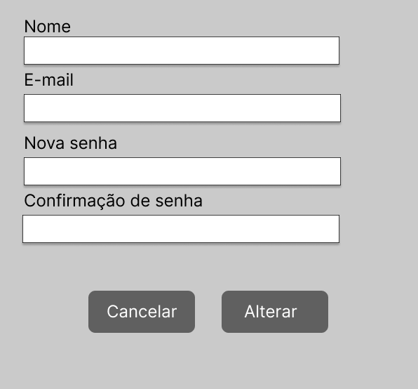

# Projeto de Interface

As telas a serem desenvolvidas e a interação entre elas foram projetadas utilizando o _Figma_. Estas estão apresentadas abaixo em imagens e textos explicativos de como atendem os requisitos do sistema para satisfazer as histórias de usuário elicitadas ao começo desse projeto.

## User Flow

O Fluxo de usuário (_User Flow_) para mapear todas as telas do site e traçar os possíveis caminhos de ações de cliente final (comprador) e artesão (vendedor) dentro da plataforma de e-commerce formam o diagrama abaixo que é apresentado na Figura 1. A imagem abaixo também pode ser consultada através do link: https://www.figma.com/file/dtoi7KXOF72EnLxpJm6GAy/Fluxo_usu%C3%A1rio_artes%C3%A3o?node-id=0%3A1 onde é possível ampliar para visualizar melhor o fluxo. Cada uma das telas será, no entanto, apresentada posteriormente em detalhes.

##### Figura 1: Fluxo de usuário para o e-commerce de artesãos

Fonte: dos autores.

## Wireframes

Conforme o fluxo de telas apresentado anteriormente, os _wireframes_ de cada uma das telas a serem desenvolvidas no sistema são apresentadas a seguir:

### Login

Nessa tela (Fugira 2) é apresentada a opção de realizar login através do e-mail ou nome de usuário e senha previamente cadastrados no sistema, ou também através das contas de Facebook e Google. Caso o login ou senha estejam incorretos, o sistema responderá com uma mensagem de erro e solicitará que as informações sejam redigitadas. Nessa tela o usuário também poderá optar por recuperar a senha da conta, e aqueles não cadastrados poderão se cadastrar clicando no botão "criar nova conta".

Entrando com os dados cadastrais corretamente, o usuário redirecionado para a tela principal "Home Page Cliente" ou "Home Page Artesão"

##### Figura 2: Tela de Login

Fonte: dos autores

### Cadastro de cliente e de artesão

Ambas as telas são apresentadas abaixo e são semelhantes em muitos aspectos. Nelas é possível escolher um nome de usuário que será aceito caso o mesmo ainda não se encontre cadastrado na base de dados. O e-mail e a senha também deverão ser informados. Para cadastro da senha haverão critérios a serem seguidos que estão claros na tela e a mesma só será aceita caso tais regras sejam seguidas. Ambos os usuários, cliente e artesão, devem clicar no botão "Cadastrar" para que o cadastro seja efetuado e o usuário seja redirecionado para suas homepages. Os artesãos, diferente dos clientes, receberão posteriormente em seu e-mail as regras legais e de boas práticas que regulamentam o comércio eletrônico. Ao se cadastrarem, eles concordam que somente disponibilizarão à venda produtos que obedeçam às diretrizes que receberão na documentação via e-mail. Seguem ambas as páginas apresentadas nas figuras 3 e 4.

##### Figura 3: Cadastro de usuários (compradores) no e-commerce

Fonte: dos autores.

##### Figura 4: Cadastro de artesãos (vendedores) no e-commerce

Fonte: dos autores

### Home Page do Cliente

A tela (Figura 5) mostra a página do cliente, após a criação da conta e/ou login e já traz junto ao menu, o nome da pessoa cadastrada. Com base na estrutura padrão, o bloco de conteúdo traz as seguintes categorias de produtos: melhor avaliados, mais vendidos e últimos cadastrados, sendo que a busca por esses tópicos acontece através do uso da barra de rolagem na lateral direita. Os produtos de cada categoria apresentados na tela são acompanhados pela descrição, resumo de avaliações e preço, bem como os botões de setas laterais para busca. Ainda no bloco de conteúdo constam mais dois elementos:
- A opção de procurar um determinado item através do preenchimento do campo pelo nome do produto ou a descrição, e a busca é realizada ao clicar no botão da lupa;
- Ao clicar na lupa, o cliente é redirecionado para a página de resultados de pesquisa.
- A opção de ordenar os itens disponíveis pelos mais vendidos, melhor avaliados e últimos cadastrados. O site apresenta as opções de seleção ao clicar na seta para baixo.
O bloco da barra lateral traz as seguintes opções: alteração dos dados cadastrais do cliente, os pedidos realizados e o histórico de compras.

##### Figura 5: Homepage do cliente

Fonte: dos autores

### Página de Resultado de Pesquisa
A tela de resultado de pesquisa (Figura 6) mostra ao usuário no conteúdo da página a lista de produtos pesquisados pela barra de pesquisa. Há também um menu lateral composto pela de pesquisa e um filtro baseado em categorias, material e faixa etária a qual os produtos se destinam.
- Os produtos gerados na lista da pesquisa redirecionam para uma página mais detalhada do produto.
- Os produtos gerados na lista da pesquisa podem ser adicionados ao carrinho de compra.

##### Figura 6: Tela de pesquisa e resultados de pesquisa

Fonte: dos autores.

### Exibição do Produto
Na tela de exibição do produto (Figura 7), além da barra superior usual há fotos de exibição do produto que foram inseridas pelo artesão. Ao contrário de alguns sites de e-commerce, este não obrigará ao artesão utilizar fundo branco, podendo ter um cenário personalizado como foi levantado como necessidade nas histórias de usuários e requisitos do sistema. Nela também constarão as seguintes informações:
- Título do produto com número de caracteres limitados;
- Valor;
- Breve descrição do produto: opcional, também com caracteres limitados;
- Quantidade de unidades disponíveis;
- Botão para adicioná-lo no carrinho de compras;
- Avaliação do produto de acordo com as avaliações de clientes que já compraram o produto.
- Descrição extensa do produto, onde o artesão terá mais caracteres para fornecer informações técnicas;
- Feedback dos clientes.

##### Figura 7: Tela de exibição do produto

Fonte: dos autores

### Página do carrinho de Compras
Na página do carrinho de compras (Figura 8) o cliente poderá visualizar seus pedidos salvos na lista de compras, alterar a quantidade de produtos, remover um item de sua lista e também visualizar o endereço de entrega o preço do frete e o valor total de sua compra.

Após finalizar, o usuário clicando no botão "Continuar Compra" ele será redirecionado para a página de métodos de pagamento. 

##### Figura 8: Tela do carrinho de compras

Fonte: dos autores.

### Pagamento
Na tela de pagamento (Figura 9) o cliente deverá entrar com:
- Dados pessoais: nome completo, e-mail, número de celular e um documento de pessoa física ou jurídica.
- Endereço de entrega através dos campos: endereço, complemento, cidade e CEP.
- Forma de pagamento: aqui ele poderá solicitar a forma que melhor lhe atende, preenchendo com os dados do cartão ou selecionando o boleto ou pix nos botões respectivos. Há também como selecionar o parcelamento.
- Caso opte por enviar boleto ou PIX, uma mensagem informando que ele receberá o boleto por e-mail será exibida, ou os dados para realização do PIX.
- Uma vez concluído o preenchimento de todos os campos, o cliente poderá clicar em “Comprar agora”

##### Figura 9: Tela de pagamento

Fonte: dos autores

### Histórico de Compras
Na tela de histórico de compras (Figura 10) serão exibidas as compras realizadas pelo cliente em ordem cronológica da mais antiga para a mais recente. Para cada um dos itens haverá a opção de avaliar e comprar novamente. Caso opte por avaliar, será direcionado par a tela de avaliação do produto, caso opte por recomprar, será direcionado para a tela de exibição do produto.

##### Figura 10: Tela do histórico de compras

Fonte: dos autores

### Página de Avaliação do Produto
A tela de avaliação permite ao usuário comentar um produto que foi ventido e entregue pelo artesão.
O produto pode ser avaliado através de uma nota em formato de estrelas cuja abrangência vai de 1 (ruim) a 5 (excelente) estrelas. A avaliação irá determinar uma média de pontuação para o produto interferindo na exposição do mesmo. Também será possível que ele escreva um breve comentário sobre suas impressões. Tanto a média de pontuação quando os _feedbacks_ dos clientes serão exibidos na tela de exibição do produto.

##### Foto 11: Tela de avaliação do produto

Fonte: dos autores.

### Home Page do Artesão

A tela a seguir mostra a página do artesão após a criação da conta e/ou logjn e já traz junto ao menu, o nome da pessoa cadastrada (Figura 12). Com base na estrutura padrão, o bloco de conteúdo traz os produtos cadastrados pelo artesão com a especificação completa, o preço e as avaliações postadas pelos clientes que adquiriram o produto. Nesse mesmo bloco consta também um campo de busca para facilitar a identificação de um produto específico, bem como a opção da barra de rolagem à direita. O bloco da barra lateral traz dois elementos distintos:
- As opções de alterações dos dados cadastrais do artesão;
- As opções necessárias para o cadastro, alteração e remoção dos produtos, a agenda, o histórico de vendas e o contato dos clientes para o envio das mercadorias.

##### Figura 12: Homepage do artesão

Fonte: dos autores

### Cadastro de produtos

Para cadastrar um produto novo o artesão poderá selecionar o tipo de material que o constituir, a categoria que se relaciona com o nicho de cada um, inserir imagens e fornecer os dados que serão apresentados na tela de exibição do produto. São eles: Título do anúncio, nome do produto (breve descrição caso queira), preço, quantidade disponível em estoque, a condição do mesmo como novo ou usado, e a descrição detalhada onde poderá ser incluída a ficha técnica do mesmo. Ao finalizar o preenchimento dos campos, ele deverá clicar no botão cadastrar.

##### Figura 13: Cadastro / Inclusão de novos produtos

Fonte: dos autores

### Agenda
A agenda (Figura 14) será um ambiente que facilite o controle do usuário sobre os produtos vendidos. O site, como algumas outras plataformas de e-commerce, não disponibilizará sistema integrado de envio, lojística própria. No entanto, disponibilizará na agenda o dia em que a compra foi feita e o dia máximo em que ela deve ser enviada pelo correio para o cliente que comprou a mercadoria.
Dessa forma, essa será uma ferramenta que auxiliará no controle de atividades do artesão e na gestão de atividades internas ao seu negócio.

##### Figura 14: Tela de agenda

Fonte: dos autores

### Histórico do vendedor

##### Figura 15: Tela de histórico do vendedor
A tela de histórico do vendedor conterá o histórico de vendas organizado do mais recente para o mais antigo, bem como estatísticas de seu desempenho dentro da plataforma.

Fonte: dos autores

### Chat
A janela de chat (Figura 16) possui 3 botões, o de minimizar e o de fechar a janela, e o de enviar mensagem. Nela, o usuário pode entrar em contato com a equipe de suporte para esclarecer dúvidas e buscar por informações. Inicialmente há uma mensagem de boas vindas, e um campo para que o usuário escreva a sua solicitação.

##### Figura 16: Janela de Chat

Fonte: dos autores.

### Alteração de Dados Cadastrais

A tela de alteração de dados cadastrais apresenta campos digitáveis para modificação das informações previamente definidas.
O usuário pode confirmar as alterações através do botão “Alterar” como também pode desistir e clicar no botão de “Cancelar”.
A tela é padrão tanto para o artesão quanto para o cliente.

##### Figura 17: Tela para alteração de dados cadastrais
Fonte: dos autores
