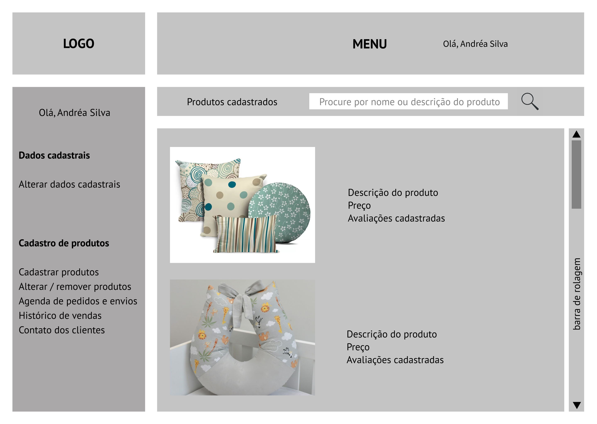
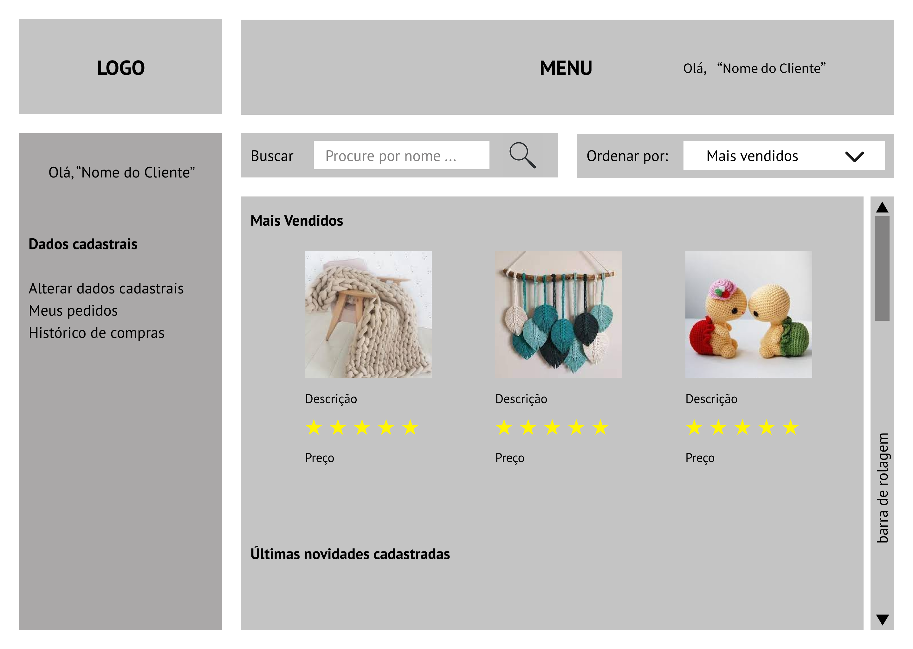

# Projeto de Interface

Pré-requisitos: <a href="2-Especificação do Projeto.md"> Documentação de Especificação</a>

Visão geral da interação do usuário pelas telas do sistema e protótipo interativo das telas com as funcionalidades que fazem parte do sistema (wireframes).

 Apresente as principais interfaces da plataforma. Discuta como ela foi elaborada de forma a atender os requisitos funcionais, não funcionais e histórias de usuário abordados nas <a href="2-Especificação do Projeto.md"> Documentação de Especificação</a>.

## User Flow

Fluxo de usuário (User Flow) é uma técnica que permite ao desenvolvedor mapear todo fluxo de telas do site ou app. Essa técnica funciona para alinhar os caminhos e as possíveis ações que o usuário pode fazer junto com os membros de sua equipe.

> **Links Úteis**:
> - [User Flow: O Quê É e Como Fazer?](https://medium.com/7bits/fluxo-de-usu%C3%A1rio-user-flow-o-que-%C3%A9-como-fazer-79d965872534)
> - [User Flow vs Site Maps](http://designr.com.br/sitemap-e-user-flow-quais-as-diferencas-e-quando-usar-cada-um/)
> - [Top 25 User Flow Tools & Templates for Smooth](https://www.mockplus.com/blog/post/user-flow-tools)
Segue o escopo do fluxograma de usuário, foi criado de forma simples com o objetivo de definir as funcionalidades e as páginas a serem criadas:
> - [Fluxo do usuário - Figma] (https://www.figma.com/file/dtoi7KXOF72EnLxpJm6GAy/Fluxo_usu%C3%A1rio_artes%C3%A3o?node-id=0%3A1)

## Wireframes

São protótipos usados em design de interface para sugerir a estrutura de um site web e seu relacionamentos entre suas páginas. Um wireframe web é uma ilustração semelhante do layout de elementos fundamentais na interface.
 
**Tela - Home Page do Artesão**

A tela mostra a página do artesão após a criação da conta e já traz junto ao menu, o nome da pessoa cadastrada.
Com base na estrutura padrão, o bloco de conteúdo traz os produtos cadastrados pelo artesão com a especificação completa, o preço e as avaliações postadas pelos clientes que adquiriram o produto. Nesse mesmo bloco consta também um campo de busca para facilitar a identificação de um produto específico, bem como a opção da barra de rolagem à direita. O bloco da barra lateral traz dois elementos distintos:
> - As opções de alterações dos dados cadastrais do artesão;
> - As opções necessárias para o cadastro, alteração e remoção dos produtos, a agenda, o histórico de vendas e o contato dos clientes para o envio das mercadorias.

**Tela - Home Page do Cliente**

Tela - Home Page do Cliente
A tela mostra a página do cliente, após a criação da conta e já traz junto ao menu, o nome da pessoa cadastrada.
Com base na estrutura padrão, o bloco de conteúdo traz as seguintes categorias de produtos: melhor avaliados, mais vendidos e últimos cadastrados, sendo que a busca por esses tópicos acontece através do uso da barra de rolagem na lateral direita. Os produtos de cada categoria apresentados na tela são acompanhados pela descrição, resumo de avaliações e preço,  bem como os botões de setas laterais para busca. Ainda no bloco de conteúdo constam mais dois elementos:
> - A opção de procurar um determinado item através do preenchimento do campo pelo nome do produto ou a descrição, e a busca é realizada ao clicar no botão da lupa;
> - A opção de ordenar os itens disponíveis pelos mais vendidos, melhor avaliados e últimos cadastrados. O site apresenta as opções de seleção ao clicar na seta para baixo.
O bloco da barra lateral traz as seguintes opções: alteração dos dados cadastrais do cliente, os pedidos realizados e o histórico de compras.

> **Links Úteis**:
> - [Protótipos vs Wireframes](https://www.nngroup.com/videos/prototypes-vs-wireframes-ux-projects/)
> - [Ferramentas de Wireframes](https://rockcontent.com/blog/wireframes/)
> - [MarvelApp](https://marvelapp.com/developers/documentation/tutorials/)
> - [Figma](https://www.figma.com/)
> - [Adobe XD](https://www.adobe.com/br/products/xd.html#scroll)
> - [Axure](https://www.axure.com/edu) (Licença Educacional)
> - [InvisionApp](https://www.invisionapp.com/) (Licença Educacional)
